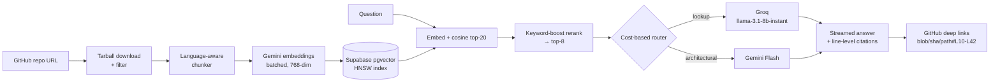

# RepoLens

Ask questions about any public GitHub repository. Paste a repo URL — RepoLens ingests
and indexes the codebase, then answers questions in a streaming chat with citations
that deep-link to the exact file and line range on GitHub. Includes a 40-case LLM eval
harness that runs in CI on every push, and a cost-based model router across free LLM
providers. Total infrastructure cost: **$0**.

<!-- TODO: screenshot / GIF -->

## Architecture



## Engineering decisions

**Chunking.** Chunks are split on function/class boundaries using per-language-family
regex heuristics (JS/TS, Python, Go, Java-like, generic), targeting 60–120 lines with a
10-line overlap. Each chunk keeps `file_path` + `start_line`/`end_line` and is embedded
with a `// path (lines a-b)` context header — that metadata is what makes line-level
citations possible on the way out.

**Heuristic router over an LLM-classifier router.** Routing decisions here are cheap to
get right with signals that are already in hand: question phrasing, question length, and
retrieval spread (how many distinct files the top chunks span). An LLM classifier would
add a full round-trip of latency and another failure mode to every query for marginal
accuracy on a two-way decision. Every routing decision is logged with its reason
(`route_reason`) so the distribution is auditable on `/stats`. Both providers sit behind
one interface with automatic failover on 429/5xx — free tiers throttle, users shouldn't
notice.

**Eval methodology.** `evals/golden.jsonl` holds 40 hand-verified Q&A cases across two
repos pinned at fixed commits (honojs/hono, expressjs/express). Every case runs through
the full pipeline with *both* router tiers forced, and is scored two ways: retrieval hit
rate (did the expected file appear in the top-8 retrieved chunks — isolates retrieval
quality from generation quality) and answer score 0–2 from an LLM judge against a
per-case rubric. Results land in an `eval_runs` table; CI fails if the pass rate drops
more than 10 points vs the previous run, so quality regressions block the merge.

**Free-tier constraints.** Serverless-safe ingestion (3,000-file / 40MB tarball caps,
in-memory extraction, `after()` for post-response indexing), batched embeddings with
retry-on-429, per-IP rate limiting via Upstash with a BYO-key escape hatch
(keys stay in localStorage, sent per-request, never stored).

## Eval results

Run `npm run eval` — the table below is generated from real runs (see `/stats` for the
live numbers; nothing here is hand-typed).

<!-- EVAL_RESULTS: populated from evals/report.md after the first pinned run -->

## Stack

Next.js 15 (App Router) · TypeScript · Tailwind v4 · Supabase Postgres + pgvector (HNSW) ·
Gemini embeddings + Gemini Flash · Groq llama-3.1-8b-instant · Upstash Redis ·
GitHub Actions · Vercel

## Running locally

```bash
npm install
cp .env.example .env.local   # fill in keys (all free tiers)
# run supabase/schema.sql in the Supabase SQL editor
npm run dev
```

```bash
npm run eval   # full eval suite; writes evals/report.md + eval_runs rows
```
